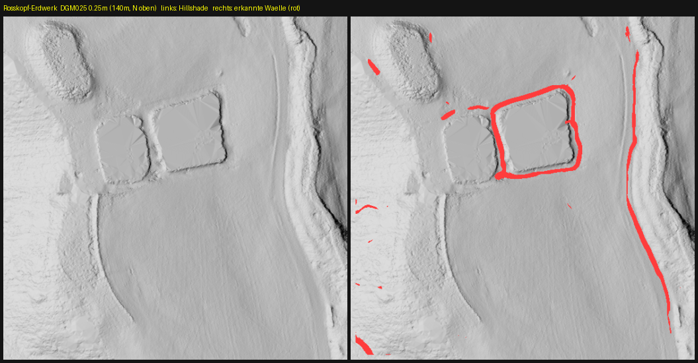

# Steckbrief: Rechteckiges Erdwerk am Rosskopf (NÖ Freiburg)

> **Status:** unbestätigter LiDAR-Befund (Kandidat). Nicht im amtlichen
> Denkmalverzeichnis gefunden. **Keine Grabung** — zur Prüfung/Meldung an die
> Denkmalpflege gedacht.

*Links: Hillshade (DGM025, 0,25 m). Rechts: automatisch erkannte Wälle (rot).
Fenster ~140 m, Norden oben.*

## Lage
| | |
|---|---|
| Zentrum (UTM32 / EPSG:25832) | **419805 E / 5321120 N** |
| Geogr. Koordinaten (WGS84) | **48.03833 N, 7.92413 E** |
| Geländehöhe | ca. **329 m NHN** |
| Lage | bewaldeter Hang am Rosskopf, nordöstlich von Freiburg i. Br. |

## Befund (aus LiDAR vermessen)
- **Rechteckige, umwallte Anlage ~38 × 40 m**, als *hohler* Umriss (Füllgrad 0,16)
  — d. h. ein ringförmiger Wall, der eine Fläche einfasst; im Inneren in
  **zwei Kammern** gegliedert.
- Zugehöriger **linearer Wall ~90 m**, Ausrichtung ~O–W.
- Typische Wallhöhe im Local-Relief-Model ~0,3–0,8 m über dem Umfeld
  (klar als Relief erkennbar, aber kein hoher Erdwall).

## Datengrundlage
- DGM1 (1 m) und **DGM025 (0,25 m)**, LGL Baden-Württemberg, ALS-Befliegung 2017
  (Open Data, Datenlizenz Deutschland).
- Luftbild **DOP20 (0,2 m, 2025)**: zeigt am Standort Wald-/Wiesenrand, **keinen**
  betonierten Hochbehälter → das Erdwerk liegt (teils) unter Baumbestand und ist
  nur im bare-earth-DGM sichtbar.

## Abgleich mit dem amtlichen Verzeichnis
- Offener WMS *Archäologische Kulturdenkmale BW* (Landesamt für Denkmalpflege):
  **kein eingetragenes Denkmal im Umkreis von 150 m**.
- Nächstgelegener bekannter Denkmaltyp im Raum: die **frühneuzeitliche
  Schanzenlinie (~1697–1713) Rosskopf–Dreisamtal–Sternwald** (eingetragen u. a.
  ~4 km südlich bei Kappler).

## Deutungshypothesen (offen — nur Feld/Experten entscheiden)
1. **Historische Wasserbecken / Stau- oder Fischteiche** — zwei rechteckige
   Kammern nebeneinander sind dafür ein typisches Muster.
2. **Redoute/Schanzenwerk** der o. g. Befestigungslinie (rechteckige Erdwerke).
3. **Gebäude-/Gewerbeplattform** (z. B. Köhlerei-/Forstanlage) oder Steinbruchrest.
4. Jüngere forstliche/wasserwirtschaftliche Anlage (nicht auszuschließen).

## Empfehlung
- Koordinaten dem **Landesamt für Denkmalpflege (Regierungspräsidium Stuttgart)**
  bzw. der **archäologischen Denkmalpflege am RP Freiburg** zur Einordnung melden.
- Vor Ort zerstörungsfrei prüfen (Begehung, Foto, ggf. Einmessung). **Nicht graben,
  nicht sondeln** (genehmigungspflichtig nach DSchG BW).

---
*Erzeugt mit der Pipeline dieses Repos (fetch_dgm_bw → lidar_prospect /
earthwork_detect → forest_filter → denkmal_check). Reproduzierbar über die
Kachel `dgm1_32_419_5321` bzw. `dgm025_32_419_5321`.*
